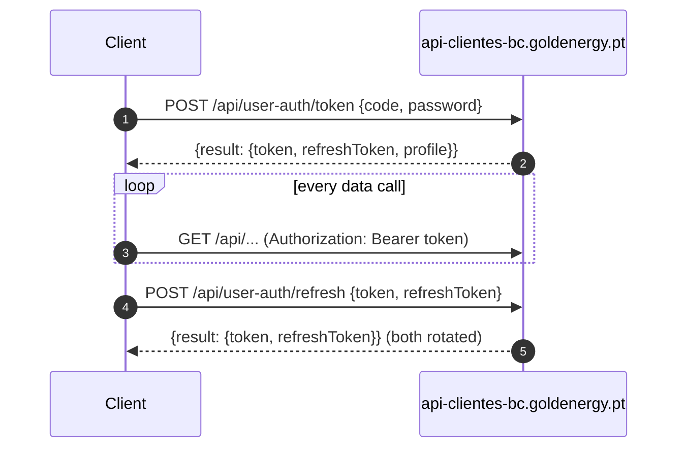

# Goldenergy customer API (reverse-engineered)

The customer area at `https://clientes.goldenergy.pt` is a WordPress site whose
pages are rendered empty and filled by jQuery calls to a separate **ASP.NET REST
API**. Home Assistant can call that API directly — no HTML scraping.

Captured from a live session on 2026-10-09 and the login/refresh/data path
re-verified from a plain Python client (`urllib`, no browser headers). All
identifiers below are placeholders.

## Hosts

| Purpose | Host |
|---------|------|
| REST API (production) | `https://api-clientes-bc.goldenergy.pt` |
| Customer-area front end | `https://clientes.goldenergy.pt` |

The front end picks the API host in `api-config.js` (`window.API_BASE_URL`);
`api-clientes-qmf2`, `api-clientes-bc-qa` and `api-clientes-bc-audit` are
non-production variants. Tokens are issued by `api-clientes-bc-int` (`iss`/`aud`),
which is internal only.

## Response envelope

Every application-level response (including errors the app handles) is:

```json
{"result": {...} | null, "generatedAt": "2026-03-04T12:00:00+00:00",
 "hasError": false, "message": "", "errorCode": null}
```

Framework-level failures (model validation, missing auth) bypass the envelope and
return ASP.NET `application/problem+json` instead — e.g. a missing bearer token
answers a bare `401 {"title":"Unauthorized","status":401}`.

## Auth



### Login — two endpoints, only one usable

| Endpoint | Body | Used by | Notes |
|----------|------|---------|-------|
| `POST /api/user-auth/rtoken` | `{code, password, recaptchaResponse, recaptchaAction: "login"}` | the web login today | reCAPTCHA v3 is **validated server-side, before the password**: a bad token answers `401 {"errorCode":"InvalidReCaptcha"}`. Unusable from Home Assistant. |
| `POST /api/user-auth/token` | `{code, password}` | the web front end's "legacy" path when reCAPTCHA is disabled | **No captcha. Works from a plain HTTP client** (verified). This is the one to use. |

`code` is the customer number (`C0000000`) or the NIF — the login form accepts
either.

A wrong password on `/token` answers the same bare `401` problem+json as an
unknown customer, so the two cannot be told apart.

`/token` answers:

```json
{"result": {"token": "<JWT>", "refreshToken": "<JWT>",
  "profile": {"customerNo": "C0000000", "name": "...", "nif": "000000000",
              "mobile": "+351...", "email": "...", "isB2BCustomer": false}},
 "hasError": false, "errorCode": null}
```

> **Risk:** `/token` survives only because the front end keeps a fallback for when
> reCAPTCHA is switched off. Goldenergy could remove it at any time. The client
> must surface a login failure as a re-auth / repair issue, not retry in a loop.

### Token lifetimes (from the JWT `exp` claims)

| Token | Lifetime | Claims |
|-------|----------|--------|
| `token` (access, HS256) | **120 s** | `nameidentifier` = customer number, `role` = `customer` |
| `refreshToken` | **1800 s** | `exp`, `iss`, `aud` only |

### Refresh — `POST /api/user-auth/refresh`

```json
{"token": "<expired access JWT>", "refreshToken": "<refresh JWT>"}
```

→ `{"result": {"token": "...", "refreshToken": "..."}}`. **Both are rotated.**
A malformed refresh token answers `200` with `hasError: true,
errorCode: "InvalidRefreshToken"` — the error is in the envelope, not the status.

With a 120 s access token every poll needs a fresh one anyway, and the refresh
token dies 30 min after it was issued. For a twice-daily poll, refreshing buys
nothing: **log in with `/token` at the start of each poll** and use the access
token for the burst of calls that follows (they complete well inside 120 s).

The browser keeps both tokens in JS-readable cookies (`token`, `refreshToken`)
on `clientes.goldenergy.pt`; nothing in the API itself is cookie-based.

## Data endpoints

All `GET`, all `Authorization: Bearer <token>`, all wrapped in the envelope.
Parameters are query-string, **PascalCase**.

| Path | Params | Returns |
|------|--------|---------|
| `/api/customer/profile` | — | the customer profile (same as on login) |
| `/api/billingAccounts/groupedservices-list` | — | every billing account, its supply addresses and their services |
| `/api/billingAccounts/single` | `BillingAccountNo` | one account: `balanceAmount`, `nextReadingDate`, `lastInvoice`, direct debit, e-invoice |
| `/api/services/single` | `BillingAccountNo`, `ServiceNo` | one service: CUI/CPE, tariff tier (`escalao`), meter(s) |
| `/api/readings/last` | `BillingAccountNo`, `ServiceNo` | the latest meter reading |
| `/api/readings/initial` | `BillingAccountNo`, `ServiceNo` | the reading at contract start |
| `/api/readings/pagelist` | `BillingAccountNo`, `ServiceNo`, `EnergyType`, `PageIndex`, `PageSize` | reading history |
| `/api/consumptions/pagelist` | `BillingAccountNo`, `ServiceNo`, `EnergyType`, `PageIndex`, `PageSize` (+ optional `InitDate`, `EndDate`) | billed consumption periods |
| `/api/consumptions/chart-info` | `BillingAccountNo`, `ServiceNo`, `InitDate`, `EndDate` (`yyyy-mm-dd`) | monthly kWh, real vs. estimated, per energy |
| `/api/consumptions/daily/pagelist` | `BillingAccountNo`, `ServiceNo`, `EnergyType=1`, `MeterNo`, `InitDate`, `EndDate`, `PageSize` | daily consumption — **electricity smart meters only**; the front end never calls it for gas |
| `/api/account-documents/calc-docs` | `BillingAccountNo`, `PageIndex`, `PageSize` | invoices |
| `/api/account-documents/pdf-file` | `BillingAccountNo`, `EntryNo` | invoice PDF (blob) |
| `/api/payments/options` | `BillingAccountNo` | pending payment options (MB references) |
| `/api/notifications/pagelist`, `/info` | `PageIndex`, `GroupType`, `InitDate`, `EndDate` | portal notifications |

The integration uses only `groupedservices-list` (config flow), `billingAccounts/single`,
`services/single`, `readings/pagelist` and `calc-docs`. It asks `readings/pagelist`
for electricity with `EnergyType=1` — the value the front end sends to its
electricity daily view; the reading list itself was only observed for gas.

Other write endpoints exist (`/api/readings/cancellation`, profile/contact/address
updates, e-invoice and direct-debit (un)subscription) and are **out of scope** —
never call them. The one write this integration makes is submitting a reading,
below.

### Enumerations

| Field | Value | Meaning |
|-------|-------|---------|
| `energyType` / `EnergyType` | `0` | gas |
| | `1` | electricity |
| service `type` | `1` | gas (`description: "Gás"`); the front end treats `0`/`1` as gas and `2`/`3` as electricity |
| `status` | `1` | active |

Electricity service/reading values were **not observed** — the captured account
has gas only. Verify against an electricity account before relying on them.

## Submitting a reading — `POST /api/readings/communication`

The integration's only write (`goldenergy.submit_reading`). The body mirrors the
customer area's form. The front end carries two formats behind a `QM_FASE2` flag
set in `api-config.js`; **production has it off**, so the format in use is:

```json
{"billingAccountNo": "CG0000000",
 "ServiceNo": "S0000000001",
 "bcServiceType": 0,
 "reading": {"energyType": 0,
             "meterNo": "CNTGAS0000000",
             "date": "2026-03-09",
             "records": [{"type": 0, "value": 165}]}}
```

- `bcServiceType` and `energyType` are the energy enumeration (0 gas, 1
  electricity). `meterNo` is the meter's `meterNo` from `services/single` — not its
  serial number, which is what the (inactive) `QM_FASE2` format sends.
- `date` is `yyyy-mm-dd`; the form only offers **today** or **yesterday**.
- `records` holds one `{type, value}` per meter register, typed by the meter's
  `recordTypes` (`[0]` for gas). Values are **whole numbers**: the form
  `parseInt`s them.
- The form refuses a value below the last reading client-side, and so does the
  integration, before sending.

Refusals answer **200 with `hasError: true`** (verified live with a value below the
last reading):

```json
{"hasError": true, "errorCode": "2",
 "message": "Erro - Leitura inferior à\u00a0 última registada!"}
```

| `errorCode` | Meaning | What the form does |
|-------------|---------|--------------------|
| `"1"` | Implies above-average consumption | Asks to confirm, then resends the same body plus `"ignoreAboveAverageConsumptionValidation": true` |
| `"2"` | Lower than the last registered reading | Shows the message |

Messages are Portuguese and padded with non-breaking spaces.

A communicated reading can be withdrawn with `POST /api/readings/cancellation`
`{"BillingAccountNo", "ServiceNo", "energyType", "communicatedReadingEntryNo"}`
(the `entryNo` of a `readings/pagelist` item whose `canCancel` is true). The
integration does not call it.

## Response shapes

### `groupedservices-list`

```json
{"result": {"billingAccounts": [
  {"billingAccountNo": "CG0000000", "status": 1,
   "initDate": "2026-03-02T00:00:00", "endDate": null,
   "nextReadingDate": "2026-04-01T00:00:00",
   "consumptionPointAddresses": [
     {"consumptionPointAddress": {"address": "...", "postCode": "0000-000", "city": "LISBOA"},
      "services": [
        {"no": "S0000000000", "type": 1, "description": "Gás",
         "initDate": "2026-03-02T00:00:00", "endDate": null, "status": 1}]}],
   "directDebit": {"iban": "...", "adc": "..."},
   "balanceAmount": 0}]}}
```

An account holds one or more supply addresses, each with one or more services
(gas and/or electricity). `billingAccountNo` + service `no` is the pair every
per-service endpoint takes. Carries NIF, IBAN, phone and address — **never log it**.

### `billingAccounts/single` — extra fields used

```json
{"initDate": "2026-03-02T00:00:00",
 "electronicInvoice": {"email": "...", "activationDate": "...", "active": true},
 "directDebit": {"iban": "...", "adc": "...", "activationDate": "...", "maximumLimit": null},
 "mgmVoucherCode": "MGM0000000",
 "memberGetMemberInfo": {"totalCollectedFriends": 0, "totalProfit": 0}}
```

- `mgmVoucherCode` is the account's referral code; the customer area's share
  buttons link to `https://amigo.goldenergy.pt/<code>`.
- `memberGetMemberInfo` counts the friends brought in and what they earned; its
  currency is not stated (both were 0 live).
- `directDebit` is `null` when there is no SEPA mandate (assumed from the
  front end; only the active case was observed). Never log its `iban`.

### `services/single` (gas)

```json
{"result": {"no": "S0000000000", "type": 1, "description": "Gás", "status": 1,
  "gas": {"energyType": 0, "cui": "PT0000000000000000XX", "escalao": "1",
          "meter": {"meterNo": "CNTGAS0000000", "serialNo": "00000000000000",
                    "digits": 5, "smartMeter": false, "recordTypes": [0]},
          "meters": [{"...": "same as meter"}]},
  "electricity": null,
  "gasProductList": [{"energyType": 0, "escalao": "1"}],
  "campaignList": [{"no": "DIGITAL_01/26", "name": "", "initDate": "...",
                    "endDate": null, "active": true}],
  "loyaltyList": [], "priorityCustomer": false, "specialNeedsCustomer": false}}
```

`campaignList[].name` was empty live, so the code in `no` identifies a campaign.

### `readings/last` / `readings/initial`

```json
{"result": {"billingAccountNo": "CG0000000", "serviceNo": "S0000000000",
  "reading": {"energyType": 0, "meterNo": "CNTGAS0000000",
              "meterSerialNo": "00000000000000", "date": "2026-03-02T00:00:00",
              "type": 0, "source": 5,
              "records": [{"type": 0, "description": "", "value": 120,
                           "unitOfMeasure": null}]}}}
```

- `records[].value` is the **cumulative meter index** (m³ for gas), a **number**
  (unlike CUR's padded strings).
- Dates are ISO 8601 **without an offset** (local Portugal time, midnight).
- `records` holds one entry per register; gas has one. Electricity multi-rate
  meters presumably have one per period (vazio/ponta/cheias) — unverified.

### `readings/pagelist`

```json
{"result": {"pageIndex": 0, "pageSize": 10, "totalItems": 1,
  "items": [{"entryNo": 10000001, "cancelled": false, "canCancel": false,
             "energyType": 0, "meterNo": "...", "meterSerialNo": "...",
             "date": "2026-03-02T00:00:00", "type": 0, "source": 5,
             "records": [{"type": 0, "value": 120}]}]}}
```

Paginated; walk `PageIndex` until `items` is exhausted against `totalItems`.
`cancelled` readings must be skipped.

### Not yet observed (empty on a 2-day-old contract)

The captured contract started two days before the capture, so these returned
empty lists. Field names below come from the front-end JS that renders them —
**re-verify against a populated account before coding against them**.

| Endpoint | Fields the front end reads |
|----------|----------------------------|
| `calc-docs` items | `entryNo`, `documentNo`, `postingDate`, `dueDate`, `amount`, `remainingAmount`, `charged`, `chargedDate`, `billingPeriodInitDate`, `billingPeriodEndDate`, `billingMethodDescription`, `mbReference` |
| `consumptions/chart-info` items | `date`, `energies[].energyType`, `energies[].meters[0].realKWh`, `energies[].meters[0].estimatedKWH` (note the inconsistent casing) |
| `consumptions/pagelist` items | `readingDate`, `meter.serialNo`, `type`, `records`, `document` |

`chart-info` reports gas in **kWh** — so, unlike CUR, the m³ → kWh conversion
may be available from the supplier rather than needing a config factor. Confirm
once the first bill lands.

> Credentials, tokens and the NIF/IBAN/CUI the payloads carry are per-account and
> must never be committed or logged. Raw captures with real data live in
> `.capture/`, which must stay out of version control.
