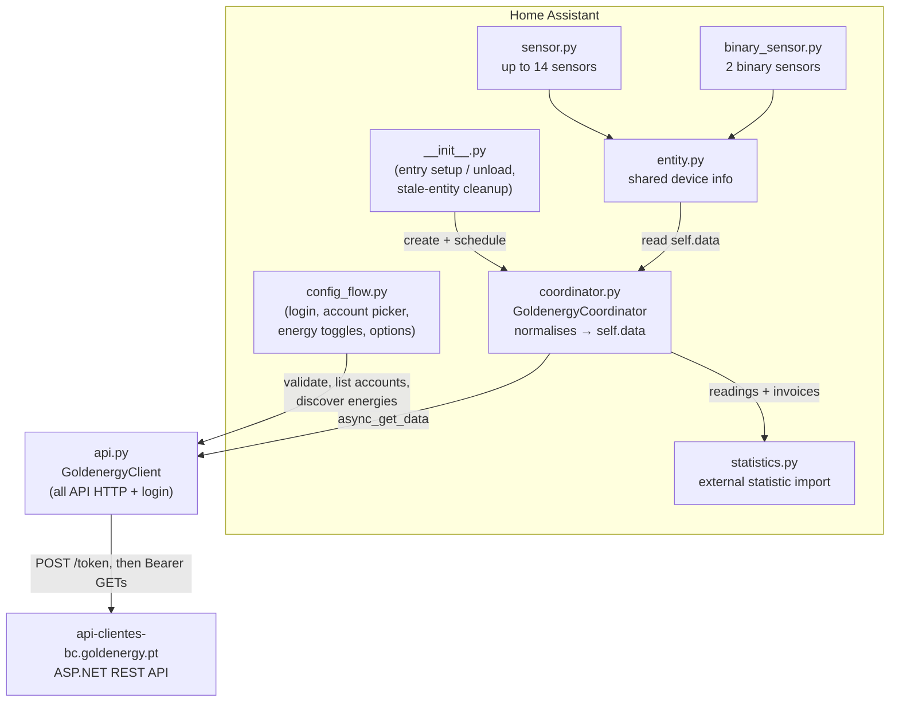
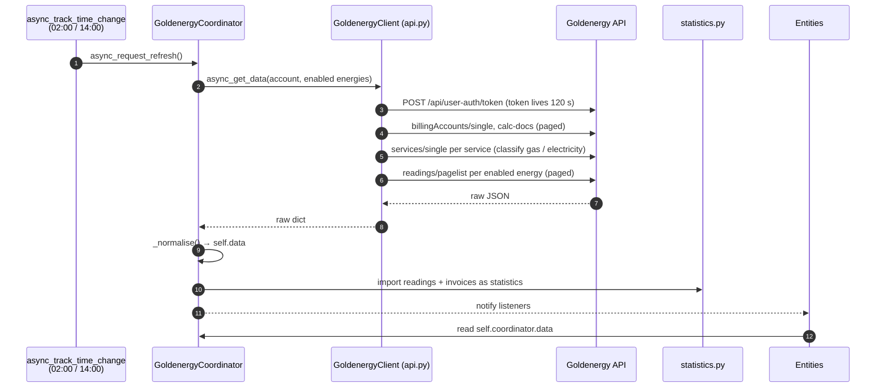
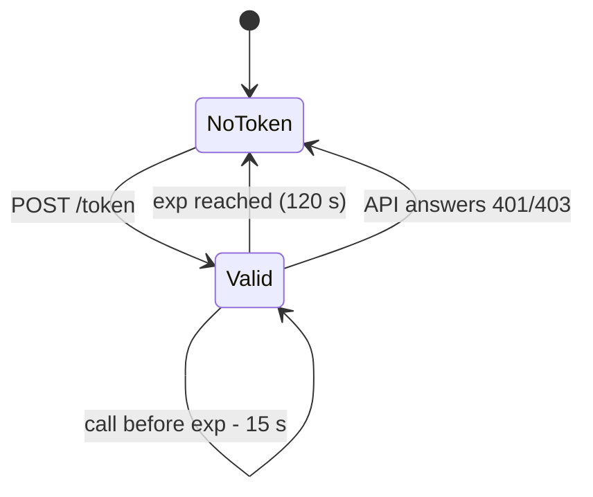

# Architecture

Goldenergy is a **cloud polling** integration. Home Assistant logs into the
Goldenergy customer area's REST API twice a day and reads the same endpoints the
web front end uses.

One config entry per **billing account**. Each entry tracks gas, electricity or
both — chosen at setup and editable in the options — and gets one device, one
entity set and its own statistics.

## Component overview



## Data flow



## Components

| File | Purpose |
|------|---------|
| `api.py` | HTTP client: private session, captcha-free login, bearer calls, pagination, service classification. **All API network logic lives here.** |
| `coordinator.py` | `DataUpdateCoordinator`; normalises the raw payloads into `self.data` (account-level keys plus one dict per energy under `services`), then hands readings and invoices to `statistics.py`. |
| `statistics.py` | Imports up to four long-term **external statistics** per account. |
| `entity.py` | Shared `CoordinatorEntity` base: unique ids, the per-account device, and `_source(energy)` to read either the account's or one energy's data. |
| `const.py` | `Final`-typed constants: config keys, endpoints, enumerations, entity keys, `coordinator.data` keys, `POLL_HOURS`. |
| `config_flow.py` | Setup (login → account → energies), re-authentication, and the options flow (energy toggles + gas conversion factor). |
| `__init__.py` | Entry point: registers the twice-daily schedule, reloads on options change, removes the entities of an energy that was switched off. |
| `sensor.py` / `binary_sensor.py` | Entities, declared as description tables. A description with `energy` set reads from that energy's dict; without it, from the account. |

## `coordinator.data` shape

```python
{
    "available": True,
    "conversion_factor": 11.2,
    # account level
    "next_reading_date": date, "balance": 0.0, "direct_debit": True,
    "last_invoice_total": ..., "amount_due": ..., "invoice_pending": ...,
    "billed_12m": ..., "invoice_series": [{"iso": ..., "total": ...}],
    # one dict per enabled energy the account actually has
    "services": {
        "gas": {"service_no", "delivery_point", "tier", "meter_serial",
                "readings": [{"iso", "index"}], "meter_index",
                "meter_index_energy", "last_consumption", ...},
        "electricity": {...},
    },
}
```

## Entities

Per energy (only for enabled energies):

| Entity | Key | Unit | State class |
|--------|-----|------|-------------|
| Gas meter index | `gas_meter_index` | m³ | `total` |
| Gas meter index (energy) | `gas_meter_index_energy` | kWh | `total` |
| Gas consumption since previous reading | `gas_last_consumption` | m³ | `measurement` |
| Gas consumption since previous reading (energy) | `gas_last_consumption_energy` | kWh | `measurement` |
| Gas last reading date | `gas_last_reading_date` | — | — (`date`) |
| Electricity meter index | `electricity_meter_index` | kWh | `total` |
| Electricity consumption since previous reading | `electricity_last_consumption` | kWh | `measurement` |
| Electricity last reading date | `electricity_last_reading_date` | — | — (`date`) |

Account level (always):

| Entity | Key | Unit | State class |
|--------|-----|------|-------------|
| Next reading date | `next_reading_date` | — | — (`date`) |
| Account balance | `balance` | € | `total` |
| Last invoice total | `last_invoice_total` | € | `total` |
| Last invoice due date | `last_invoice_due` | — | — (`date`) |
| Amount due | `amount_due` | € | `total` |
| Billed last 12 months | `billed_12m` | € | `total` |
| Invoice pending payment *(binary)* | `invoice_pending` | — | — |
| Service available *(binary, diagnostic, off by default)* | `available` | — | — |

Per-energy keys are prefixed with the energy on purpose: `__init__.py` removes
the registry entries of a disabled energy by that prefix.

## Statistics

| Statistic id | Unit | Maintained | For |
|--------------|------|-----------|-----|
| `goldenergy:gas_volume_<account>` | m³ | rewritten over the polled window | What the gas meter counted |
| `goldenergy:gas_energy_<account>` | kWh | derived from volume × factor | What gas is billed in |
| `goldenergy:electricity_energy_<account>` | kWh | rewritten over the polled window | Electricity dashboard source |
| `goldenergy:cost_<account>` | currency | append-only | `stat_cost` |

Only one of the two gas series should be wired into the Energy dashboard, or
consumption is double-counted. The cost series is per account because one
invoice bills every energy on it.

Readings are spread evenly over the days they cover, and the window is rewritten
every poll, anchored on what is already stored — the algorithm proven in the CUR
Gás Natural integration; see the module docstring of `statistics.py`.

## Polling schedule

`update_interval` is `None`. The coordinator registers two fixed daily refreshes
via `async_track_time_change` at `POLL_HOURS` (`02:00` / `14:00`). Readings and
invoices change at most monthly.

## Token lifecycle



The refresh endpoint is deliberately unused: the refresh token dies 30 minutes
after issue, so with a twice-daily poll every poll would need a full login
anyway. A 401/403 drops the token and retries the call exactly once with a fresh
login; a second rejection fails the update and surfaces as re-authentication.

## Rules

1. **All API network logic in `api.py`.** The coordinator and entities never talk
   HTTP directly.
2. **All state in the coordinator.** Entities only read `self.coordinator.data`
   and return `None` for missing values.
3. **The client owns its own session** — never the shared HA one.
4. **Poll twice a day** (`02:00` / `14:00`) via `async_track_time_change`.
5. **Never log credentials, tokens, or the NIF/IBAN/CUI** the payloads carry.
6. **Log via `_LOGGER`**, never `print()` (ruff `T20`).
7. Log in, retry once on 401, then fail.
8. A statistics failure must never fail the poll.
